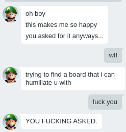
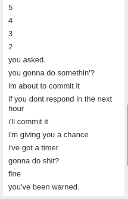
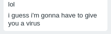

# Exposing KK64
## Chapter 1: The drama
It started on December 16 2020 when I woke up, talked to KK64, and then he started trying to humiliate me for no reason.  
Eventually, I begged him to stop.  
  
He then tried to humiliate me on 4chan, as you can see here:  
  
(By the way, I did actually see him on 4chan since I was in a virtual meeting with him when this happened. No, I do not have screenshots.)  
After that, he tried to humiliate me on Github, as you can see here:  
  
  
  
He also threatened to send me a virus:  
  
## Chapter 2: The revenge
Since I'm still doing the revenge part, this chapter will update overtime with more info.  
Anyways...  
The first thing I did was remove him from [the OpenOS Github organization](https://github.com/The-OpenOS-Team).  
Once I did that, I decided to try and reach out to his friends and tell them about what happened.  
Sadly, they did not respond. However I now have some plans on who to try and contact next about it.  
## End (for now)
That's all the info I have for now.  
I'll update this repo when I have more stuff to show.  
